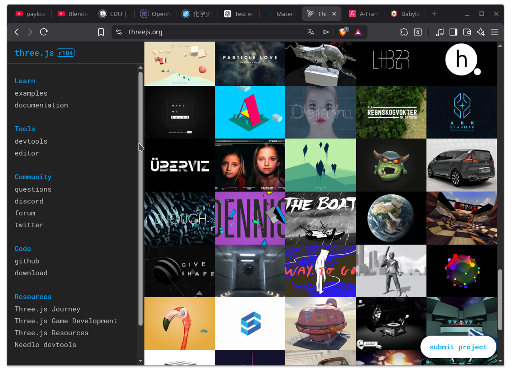
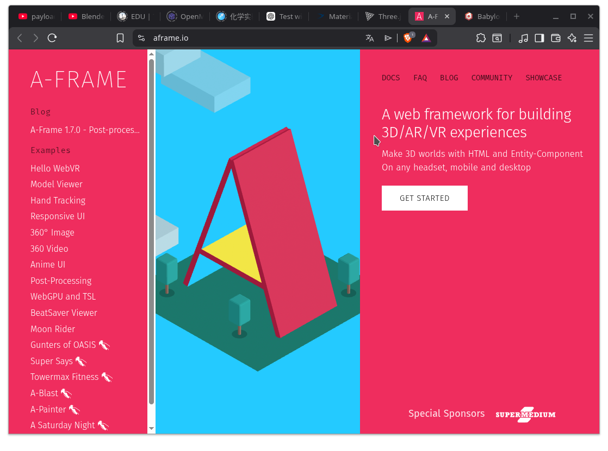
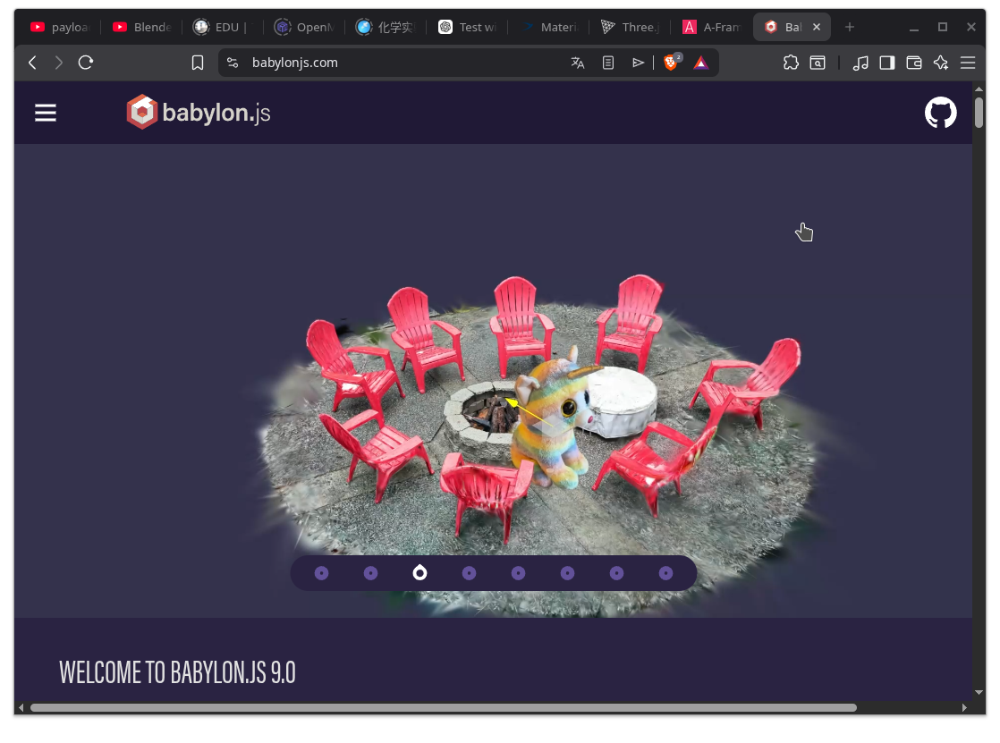
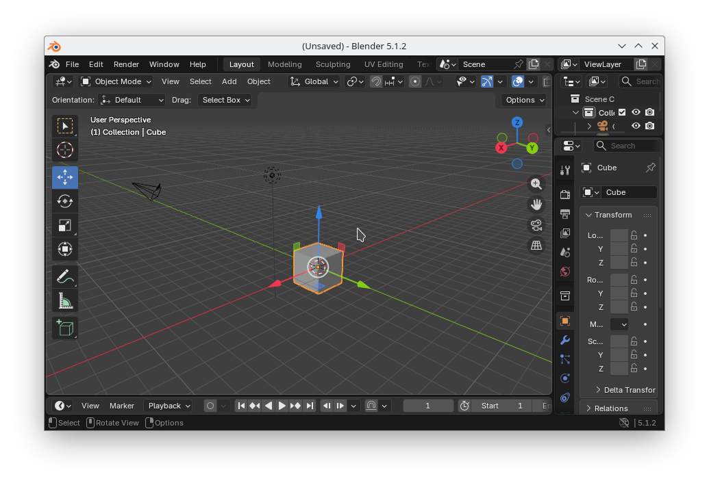

# 429-Web3D - 3D na stronach WWW

### Wstęp

1. Po co implementować 3D na stronach WWW?
2. Dostępne technologie Web3d: threejs, babylonjs, aframejs
   [](https://threejs.org/)
   [](https://aframe.io/)
   [](https://www.babylonjs.com/)
4. Scena 3D - XYZ



5. CSS 3D - http://tridiv.com/
6. Pojęcia podstawowe - Scene, Mesh, Texture, keyframe
7. Obiekty 3d
   - [sketchfab.com](https://sketchfab.com/)
   - [thingiverse.com](thingiverse.com)
   - [free 3d.com](https://free3d.com/)

### ZADANIA

#### ZAD42901
Przygotuj stronę HTML przedstawiającą pojedynczy element HTML (jednokolorowy div/obraz) stale obracający się wokół osi Y

#### ZAD42902
Przygotuj prostą scenę 3d (np pojedynczy prostopadłościan) i opublikuj ją na publicznym serwerze

#### ZAD42903
Przygotuj scenę prezentującą obiekt 3D pobrany z darmowego źródła

#### ZAD42904
Przygotuj witrynę w PHP/MySQL pozwalającą na wysłanie pliku 3d na serwer oraz zapis w bazie danych linku do podstrony przedstawiającej scenę z wybranym modelem 3d. Pozwól na wybór tych linków z listy.

### Examples

https://freefrontend.com/css-3d-examples/
https://icons8.com/preloaders/en/free#

<!-- 
```html
 <!DOCTYPE html>
<html>
  <head>
    <script src="https://aframe.io/releases/1.4.2/aframe.min.js"></script>
  </head>
  <body>
    <a-scene>
      <a-box position="-1 0.5 -3" rotation="0 45 0" color="#4CC3D9"></a-box>
      <a-sphere position="0 1.25 -5" radius="1.25" color="#EF2D5E"></a-sphere>
      <a-cylinder position="1 0.75 -3" radius="0.5" height="1.5" color="#FFC65D"></a-cylinder>
      <a-plane position="0 0 -4" rotation="-90 0 0" width="4" height="4" color="#7BC8A4"></a-plane>
      <a-sky color="#ECECEC"></a-sky>
    </a-scene>
  </body>
</html>
```
-->


### Tools
2. Blender3D
3. Meshroom
4. Aegisoft Photoscan
5. Reality Capture

## Tuts
https://webkod.pl/kurs-css/lekcje/dzial-4/css3-animowana-karta-3d
https://webkod.pl/kurs-css/lekcje/dzial-4/css3-animowany-szescian-3d
https://www.youtube.com/watch?v=IN1nyU_CL7A

### Libs
https://github.com/acweathersby/js.blend

### -------- Free 3D Objects download
www.thingiverse.com \
www.sketchfab.com \
www.cgtrader.com \
https://free3d.com \
www.trbosquid.com \
https://3dwarehouse.sketchup.com \
https://pinshape.com \
https://hum3d.com/free \
https://done3d.com \
https://cults3d.com

### ---------Assets
https://cdnjs.com/ | https://fontawesome.com | http://fontello.com/ | https://fonts.google.com/ |
### ---------Stock Img
https://www.pexels.com/ | https://unsplash.com | https://pixabay.com
### ---------Licence
[MIT](https://choosealicense.com/licenses/mit/)
